# 🏗️ SwasthyaSync — Class Diagram

> Shows the hexagonal architecture: Domain Entities, Repository Interfaces (Ports), Infrastructure Implementations (Adapters), Application Use Cases, DTOs, Mappers, Validators, Domain Events, and the EventBus. Derived from `src/modules/`.

---

## Understanding

SwasthyaSync follows a **Hexagonal (Ports & Adapters) Architecture** with **Dependency Inversion**:

- **Domain Layer** — Pure TypeScript interfaces/entities. No framework dependencies.
- **Application Layer** — Use Cases orchestrate business logic. DTOs are the only objects that leave this boundary. Validators (Zod) guard the entry gate.
- **Infrastructure Layer** — Drizzle ORM repositories implement the domain ports. Adapters for BullMQ, Redis, etc.
- **Composition Root** — Wires everything together. Subscribes side-effects to domain events.
- **API Layer** — tRPC routers call use cases. Protected by auth middleware.

---

## Diagram

```mermaid
classDiagram
    direction TB

    %% ═══════════════════════════════════
    %% DOMAIN LAYER — HEALTH MODULE
    %% ═══════════════════════════════════
    class HealthMetric {
        <<interface>>
        +id? : number
        +userId : string
        +type : MetricType
        +value : number | string
        +unit? : string
        +timestamp : Date
    }

    class MedicalAppointment {
        <<interface>>
        +id : string
        +userId : string
        +doctorName : string
        +specialty? : string
        +appointmentDate : Date
        +location? : string
        +notes? : string
        +status : scheduled | completed | cancelled
        +createdAt : Date
    }

    class HealthVaultRecord {
        <<interface>>
        +id : string
        +userId : string
        +title : string
        +category : Report | Prescription | Lab Result | Other
        +fileUrl? : string
        +recordDate : Date
        +tags? : string[]
        +createdAt : Date
    }

    class MetricRepository {
        <<interface>>
        +save(metric) HealthMetric
        +findByUserId(userId) HealthMetric[]
    }

    class MedicalRepository {
        <<interface>>
        +getAppointments(userId) MedicalAppointment[]
        +saveAppointment(appt) void
        +getVaultRecords(userId) HealthVaultRecord[]
        +saveVaultRecord(rec) void
    }

    class MetricLoggedEvent {
        +name : string = health.metric_logged
        +timestamp : Date
        +payload : HealthMetric
    }

    %% ═══════════════════════════════════
    %% DOMAIN LAYER — FITNESS MODULE
    %% ═══════════════════════════════════
    class Exercise {
        <<interface>>
        +id : string
        +name : string
        +category : string
        +targetMuscles? : string[]
        +equipment? : string[]
        +mechanic? : compound | isolation
        +force? : push | pull | static
        +level? : beginner | intermediate | expert
    }

    class Workout {
        <<interface>>
        +id : string
        +userId : string
        +name : string
        +exerciseIds : string[]
        +createdAt : Date
    }

    class WorkoutLog {
        <<interface>>
        +id : string
        +userId : string
        +workoutId? : string
        +date : Date
        +durationMinutes : number
        +caloriesBurned? : number
        +sets : ExerciseSet[]
        +notes? : string
    }

    class ExerciseSet {
        <<interface>>
        +exerciseId : string
        +setNumber : number
        +setType : warmup | working | dropset | failure
        +reps? : number
        +weight? : number
        +rpe? : number
    }

    class Nutrients {
        <<interface>>
        +calories : number
        +protein : number
        +carbs : number
        +fat : number
        +fiber? : number
        +iron? : number
    }

    class Food {
        <<interface>>
        +id : string
        +name : string
        +brand? : string
        +nutrients : Nutrients
        +servingSize : number
        +servingUnit : string
    }

    class NutritionLogEntry {
        <<interface>>
        +id : string
        +userId : string
        +date : Date
        +mealType : string
        +foodId? : string
        +quantity : number
        +unit : string
        +nutrients : Nutrients
    }

    class Goal {
        <<interface>>
        +id : string
        +userId : string
        +type : nutrition | workout | weight | custom
        +status : active | completed | archived
        +targetNutrients? : Nutrients
    }

    class AIInsight {
        <<interface>>
        +id : string
        +userId : string
        +type : recommendation | analysis | prediction
        +content : string
        +source : workout | nutrition | general
    }

    class SleepLog {
        <<interface>>
        +id : string
        +userId : string
        +date : Date
        +qualityScore? : number
        +totalDurationMinutes? : number
    }

    class FastingLog {
        <<interface>>
        +id : string
        +userId : string
        +startTime : Date
        +endTime? : Date
        +targetDurationHours? : number
        +isCompleted : boolean
    }

    class WaterIntake {
        <<interface>>
        +id : string
        +userId : string
        +date : Date
        +amountMl : number
        +containerId? : string
    }

    class WaterContainer {
        <<interface>>
        +id : string
        +userId : string
        +name : string
        +volumeMl : number
        +isDefault : boolean
    }

    class DailySummary {
        <<interface>>
        +id : string
        +userId : string
        +date : Date
        +totalCaloriesIn : number
        +totalCaloriesOut : number
        +netCalories : number
    }

    class TdeeLog {
        <<interface>>
        +id : string
        +userId : string
        +tdee : number
        +confidence : HIGH | MEDIUM | LOW
        +isFallback : boolean
    }

    class ExternalProvider {
        <<interface>>
        +id : string
        +userId : string
        +providerType : garmin | fitbit | strava | polar | withings
        +isActive : boolean
    }

    class FamilyAccess {
        <<interface>>
        +id : string
        +ownerId : string
        +memberId : string
        +permissions : object
        +isActive : boolean
    }

    class FitnessRepository {
        <<interface>>
        +saveExercise(ex) void
        +saveWorkout(w) void
        +logWorkout(log) void
        +getWorkouts(userId) Workout[]
        +getWorkoutLogs(userId) WorkoutLog[]
        +saveFood(food) void
        +logNutrition(log) void
        +getNutritionLogs(userId) NutritionLogEntry[]
        +saveGoal(goal) void
        +getGoals(userId) Goal[]
        +saveAIInsight(insight) void
        +getAIInsights(userId) AIInsight[]
        +saveSleepLog(log) void
        +getSleepLogs(userId) SleepLog[]
        +saveFastingLog(log) void
        +saveDailySummary(s) void
        +logWaterIntake(intake) void
        +getWaterIntake(userId, date) WaterIntake[]
        +saveWaterContainer(c) void
        +saveTdeeLog(log) void
    }

    %% ═══════════════════════════════════
    %% DOMAIN LOGIC
    %% ═══════════════════════════════════
    class TdeeCalculator {
        <<static>>
        +calculate(measurements, nutrition, date) TdeeResult
        -fallbackResult(tdee, reason) TdeeResult
        -getConfidence(calDays, weightEntries, span) string
    }

    class CalorieBurnEstimator {
        <<static>>
        +estimate(session, user) number
        +calculate1RM(weight, reps) number
    }

    %% ═══════════════════════════════════
    %% APPLICATION LAYER — HEALTH
    %% ═══════════════════════════════════
    class MetricDTO {
        <<DTO>>
        +id : number
        +type : string
        +value : number | string
        +unit : string | null
        +timestamp : string
    }

    class MetricMapper {
        <<Mapper>>
        +toDTO(entity) MetricDTO
        +toDTOs(entities) MetricDTO[]
    }

    class CreateMetricSchema {
        <<Zod Validator>>
        +type : enum
        +value : number | string
        +unit? : string
    }

    class LogMetricUseCase {
        -metricRepository : MetricRepository
        -eventBus : EventBus
        +execute(userId, data) MetricDTO
    }

    class GetMetricsUseCase {
        -metricRepository : MetricRepository
        +execute(userId) MetricDTO[]
    }

    class GetHealthInsightsUseCase {
        -metricRepository : MetricRepository
        +execute(userId) HealthInsightsDTO
    }

    class GetUnifiedPulseDashboardUseCase {
        -fitnessRepo : FitnessRepository
        -metricRepo : MetricRepository
        -medicalRepo : MedicalRepository
        +execute(userId) UnifiedPulsePayload
    }

    %% ═══════════════════════════════════
    %% APPLICATION LAYER — FITNESS
    %% ═══════════════════════════════════
    class LogWorkoutUseCase {
        -repo : FitnessRepository
        +execute(log) void
    }

    class LogMealUseCase {
        -repo : FitnessRepository
        +execute(log) void
    }

    class GetFitnessDashboardUseCase {
        -repo : FitnessRepository
        +execute(userId) FitnessDashboard
    }

    class SetGoalUseCase {
        -repo : FitnessRepository
        +execute(goal) void
    }

    class GenerateInsightsUseCase {
        -repo : FitnessRepository
        +execute(userId) void
    }

    class UpdateAdaptiveTdeeUseCase {
        -repo : FitnessRepository
        +execute(userId) void
    }

    %% ═══════════════════════════════════
    %% INFRASTRUCTURE LAYER
    %% ═══════════════════════════════════
    class DrizzleMetricRepository {
        +save(metric) HealthMetric
        +findByUserId(userId) HealthMetric[]
    }

    class DrizzleMedicalRepository {
        +getAppointments(userId) MedicalAppointment[]
        +saveAppointment(appt) void
        +getVaultRecords(userId) HealthVaultRecord[]
        +saveVaultRecord(rec) void
    }

    class DrizzleFitnessRepository {
        +saveExercise(ex) void
        +saveWorkout(w) void
        +logWorkout(log) void
        +getWorkouts(userId) Workout[]
        +logNutrition(log) void
        +saveSleepLog(log) void
        +logWaterIntake(intake) void
        +saveDailySummary(s) void
        +saveTdeeLog(log) void
    }

    %% ═══════════════════════════════════
    %% CROSS-CUTTING: EVENT BUS
    %% ═══════════════════════════════════
    class DomainEvent {
        <<interface>>
        +name : string
        +payload : any
        +timestamp : Date
    }

    class EventBus {
        -emitter : EventEmitter
        +publish(event) void
        +subscribe(eventName, handler) void
    }

    %% ═══════════════════════════════════
    %% API LAYER (tRPC)
    %% ═══════════════════════════════════
    class healthRouter {
        <<tRPC Router>>
        +getMetrics(ctx) MetricDTO[]
        +getHealthInsights(ctx) HealthInsightsDTO
        +getUnifiedPulse(ctx) UnifiedPulsePayload
        +logMetric(ctx, input) MetricDTO
    }

    class fitnessRouter {
        <<tRPC Router>>
        +getDashboard(ctx) FitnessDashboard
        +getExercises(ctx) Exercise[]
        +logWorkout(ctx, input) void
        +logMeal(ctx, input) void
        +syncTdee(ctx) void
        +logSleep(ctx, input) void
        +logWater(ctx, input) void
        +startFast(ctx, input) void
        +setGoal(ctx, input) void
    }

    %% ═══════════════════════════════════
    %% RELATIONSHIPS
    %% ═══════════════════════════════════

    %% Domain relationships
    WorkoutLog --> ExerciseSet : contains
    NutritionLogEntry --> Nutrients : snapshots
    Food --> Nutrients : has
    Goal --> Nutrients : targets
    MetricLoggedEvent ..|> DomainEvent : implements

    %% Ports & Adapters
    DrizzleMetricRepository ..|> MetricRepository : implements
    DrizzleMedicalRepository ..|> MedicalRepository : implements
    DrizzleFitnessRepository ..|> FitnessRepository : implements

    %% Use Cases depend on Ports (DIP)
    LogMetricUseCase --> MetricRepository : depends on
    LogMetricUseCase --> EventBus : publishes to
    LogMetricUseCase --> MetricMapper : uses
    GetMetricsUseCase --> MetricRepository : depends on
    GetHealthInsightsUseCase --> MetricRepository : depends on
    GetUnifiedPulseDashboardUseCase --> FitnessRepository : depends on
    GetUnifiedPulseDashboardUseCase --> MetricRepository : depends on
    GetUnifiedPulseDashboardUseCase --> MedicalRepository : depends on

    LogWorkoutUseCase --> FitnessRepository : depends on
    LogMealUseCase --> FitnessRepository : depends on
    GetFitnessDashboardUseCase --> FitnessRepository : depends on
    SetGoalUseCase --> FitnessRepository : depends on
    GenerateInsightsUseCase --> FitnessRepository : depends on
    UpdateAdaptiveTdeeUseCase --> FitnessRepository : depends on

    %% tRPC Routers call Use Cases
    healthRouter --> LogMetricUseCase : calls
    healthRouter --> GetMetricsUseCase : calls
    healthRouter --> GetHealthInsightsUseCase : calls
    healthRouter --> GetUnifiedPulseDashboardUseCase : calls

    fitnessRouter --> LogWorkoutUseCase : calls
    fitnessRouter --> LogMealUseCase : calls
    fitnessRouter --> GetFitnessDashboardUseCase : calls
    fitnessRouter --> SetGoalUseCase : calls
    fitnessRouter --> UpdateAdaptiveTdeeUseCase : calls

    %% Event Bus wiring
    EventBus --> MetricLoggedEvent : dispatches
```

---

> *Source of truth: `src/modules/health/`, `src/modules/fitness/`, `src/server/routers/`, `src/lib/events/`*
