# 📊 SwasthyaSync — ER Diagram (Entity-Relationship)

> Shows all 21 database tables with their columns, primary keys, and foreign key relationships. Derived from the Drizzle schema (`src/lib/db/schema.ts`, `src/modules/fitness/infrastructure/schema.ts`) and migration (`drizzle/0000_easy_hex.sql`).

---

## Understanding

The database is organized into **three domains**:

| Domain | Tables | Purpose |
|---|---|---|
| **Auth** | `user`, `session`, `account`, `verification` | User identity, sessions, OAuth providers, email verification |
| **Health** | `health_metrics`, `medical_appointments`, `health_vault_records` | Core vitals tracking, doctor visits, document storage |
| **Fitness** | 14 tables (`fitness_*`) | Workouts, nutrition, sleep, fasting, hydration, goals, TDEE, AI insights, family access, external providers |

**Key Design Decisions:**
- Every user-owned table has a `userId` FK pointing to `user.id`
- `fitness_workout_logs` also references `fitness_workouts` (a workout template)
- `fitness_family_access` has **two** FKs to `user` — `owner_id` and `member_id`
- JSON columns (`jsonb`) are used for flexible data: nutrients, exercise sets, sleep stages, permissions

---

## Diagram

```mermaid
erDiagram
    %% ═══════════════════════════════════
    %% AUTH DOMAIN
    %% ═══════════════════════════════════
    user {
        text id PK
        text name
        text email UK
        boolean emailVerified
        text image
        timestamp createdAt
        timestamp updatedAt
    }

    session {
        text id PK
        timestamp expiresAt
        text token UK
        timestamp createdAt
        timestamp updatedAt
        text ipAddress
        text userAgent
        text userId FK
    }

    account {
        text id PK
        text accountId
        text providerId
        text userId FK
        text accessToken
        text refreshToken
        text idToken
        timestamp accessTokenExpiresAt
        timestamp refreshTokenExpiresAt
        text scope
        text password
        timestamp createdAt
        timestamp updatedAt
    }

    verification {
        text id PK
        text identifier
        text value
        timestamp expiresAt
        timestamp createdAt
        timestamp updatedAt
    }

    %% ═══════════════════════════════════
    %% HEALTH DOMAIN
    %% ═══════════════════════════════════
    health_metrics {
        integer id PK
        text userId FK
        text type
        text value
        text unit
        timestamp timestamp
    }

    medical_appointments {
        text id PK
        text userId FK
        text doctorName
        text specialty
        timestamp appointmentDate
        text location
        text notes
        text status
        timestamp createdAt
    }

    health_vault_records {
        text id PK
        text userId FK
        text title
        text category
        text fileUrl
        timestamp recordDate
        text tags
        timestamp createdAt
    }

    %% ═══════════════════════════════════
    %% FITNESS DOMAIN
    %% ═══════════════════════════════════
    fitness_exercises {
        text id PK
        text name
        text description
        text category
        jsonb target_muscles
        jsonb equipment
        text mechanic
        text force
        text level
    }

    fitness_workouts {
        text id PK
        text userId FK
        text name
        text description
        jsonb exercise_ids
        timestamp created_at
    }

    fitness_workout_logs {
        text id PK
        text userId FK
        text workout_id FK
        timestamp date
        integer duration_minutes
        integer calories_burned
        integer avg_heart_rate
        integer steps
        text notes
        jsonb sets
    }

    fitness_foods {
        text id PK
        text name
        text brand
        integer calories
        double protein
        double carbs
        double fat
        jsonb micronutrients
        double serving_size
        text serving_unit
    }

    fitness_nutrition_logs {
        text id PK
        text userId FK
        date date
        text meal_type
        text food_name
        text food_id
        text meal_id
        double quantity
        text unit
        jsonb nutrients
    }

    fitness_daily_summaries {
        text id PK
        text userId FK
        date date
        double total_calories_in
        double total_calories_out
        double net_calories
        double weight_kg
        integer steps
        integer sleep_minutes
        integer water_ml
        integer mood_score
        jsonb metadata
    }

    fitness_tdee_logs {
        text id PK
        text userId FK
        date date
        double tdee
        text confidence
        boolean is_fallback
        jsonb calculation_context
    }

    fitness_sleep_logs {
        text id PK
        text userId FK
        date date
        timestamp bed_time
        timestamp wake_time
        integer total_duration_minutes
        integer quality_score
        jsonb stages
        integer latency_minutes
        jsonb metadata
    }

    fitness_fasting_logs {
        text id PK
        text userId FK
        timestamp start_time
        timestamp end_time
        integer target_duration_hours
        boolean is_completed
        jsonb metadata
    }

    fitness_water_intake {
        text id PK
        text userId FK
        timestamp date
        integer amount_ml
        text container_id
    }

    fitness_water_containers {
        text id PK
        text userId FK
        text name
        integer volume_ml
        boolean is_default
    }

    fitness_goals {
        text id PK
        text userId FK
        text type
        date goal_date
        jsonb target_nutrients
        jsonb target_values
        text status
    }

    fitness_external_providers {
        text id PK
        text userId FK
        text provider_type
        text access_token
        text refresh_token
        timestamp token_expiry
        timestamp last_sync
        boolean is_active
        jsonb config
    }

    fitness_family_access {
        text id PK
        text owner_id FK
        text member_id FK
        jsonb permissions
        boolean is_active
    }

    fitness_ai_insights {
        text id PK
        text userId FK
        text type
        text content
        text source
        timestamp created_at
    }

    %% ═══════════════════════════════════
    %% RELATIONSHIPS
    %% ═══════════════════════════════════
    user ||--o{ session : "has sessions"
    user ||--o{ account : "has accounts"

    user ||--o{ health_metrics : "logs metrics"
    user ||--o{ medical_appointments : "schedules"
    user ||--o{ health_vault_records : "stores records"

    user ||--o{ fitness_workouts : "creates templates"
    user ||--o{ fitness_workout_logs : "logs workouts"
    fitness_workouts ||--o{ fitness_workout_logs : "template for"

    user ||--o{ fitness_nutrition_logs : "logs meals"
    user ||--o{ fitness_daily_summaries : "daily summary"
    user ||--o{ fitness_tdee_logs : "TDEE history"
    user ||--o{ fitness_sleep_logs : "logs sleep"
    user ||--o{ fitness_fasting_logs : "logs fasts"
    user ||--o{ fitness_water_intake : "logs water"
    user ||--o{ fitness_water_containers : "owns containers"
    user ||--o{ fitness_goals : "sets goals"
    user ||--o{ fitness_external_providers : "connects providers"
    user ||--o{ fitness_ai_insights : "receives insights"
    user ||--o{ fitness_family_access : "owns (as owner)"
    user ||--o{ fitness_family_access : "member of"
```

---

> *Source of truth: `src/lib/db/schema.ts`, `src/modules/fitness/infrastructure/schema.ts`, `drizzle/0000_easy_hex.sql`*
