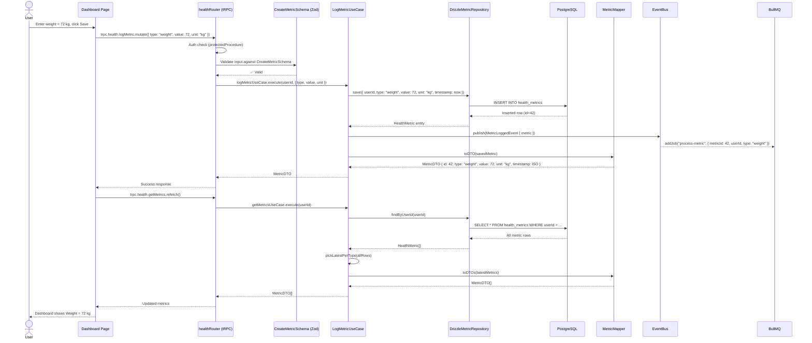
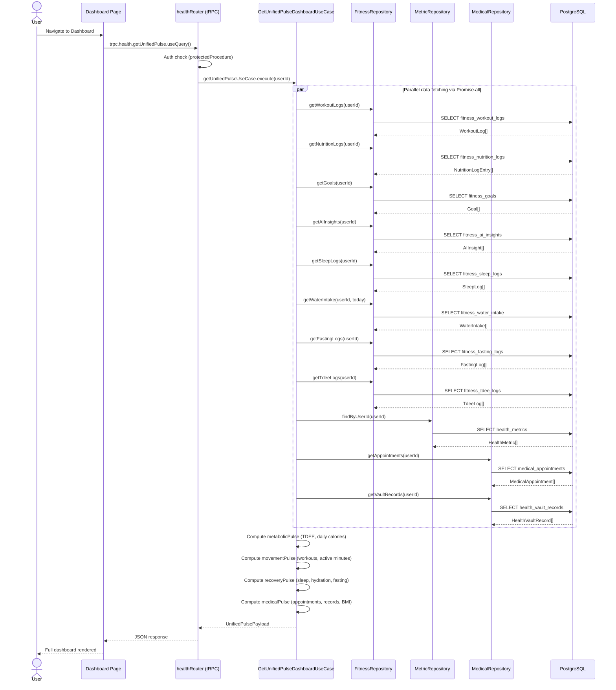
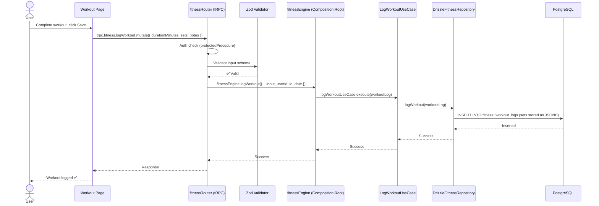
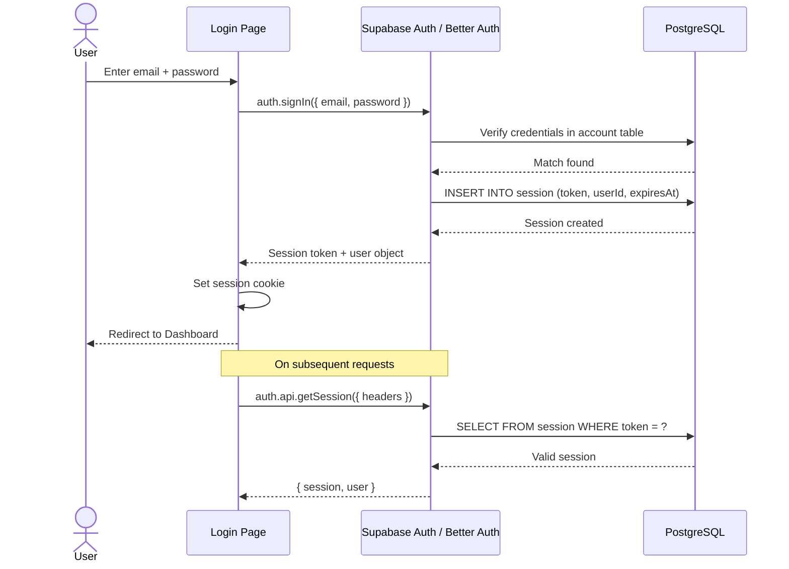

# 🔄 SwasthyaSync — Sequence Diagrams

> Shows the runtime flow of key operations through all architecture layers. Derived from `src/modules/health/FLOW.txt`, tRPC routers, use cases, and composition roots.

---

## 1. Log Health Metric (Weight / Height / Blood Group)

The primary write flow. Demonstrates the full hexagonal pipeline including domain events and background job enqueuing.

---

## 2. Get Unified Pulse Dashboard

The master dashboard read that aggregates data from **three repositories** in parallel.

---

## 3. Log Workout

Demonstrates the fitness module write flow.

---

## 4. User Authentication Flow

---

> *Source of truth: `src/modules/health/FLOW.txt`, `src/server/routers/`, `src/modules/*/application/use-cases/`*
