# 👥 SwasthyaSync — Use Case Diagram

> Shows all actors and the features they interact with in the current system. Derived from tRPC routers, composition roots, and domain event subscribers.

---

## Understanding

There are **three actors**:
1. **User (Patient)** — The primary user who tracks their health
2. **System (Background Worker)** — BullMQ jobs triggered by domain events
3. **External Provider** — Future integrations (Garmin, Fitbit, etc.)

---

## Diagram

```mermaid
graph TB
    subgraph Actors
        A[👤 User / Patient]
        S[⚙️ System / Background Worker]
        E[🔗 External Provider]
    end

    subgraph Auth["🔐 Authentication"]
        A1[Sign Up with Email]
        A2[Login with Email/Password]
        A3[Login with Google OAuth]
        A4[Manage Session]
        A5[Logout]
    end

    subgraph Health["🫀 Health Tracking"]
        H1[Log Health Metric - Weight / Height / Blood Group]
        H2[View Latest Metrics on Dashboard]
        H3[Get Health Insights - BMI / Hydration / Weight Status]
    end

    subgraph Medical["🩺 Medical Records"]
        M1[Schedule Doctor Appointment]
        M2[View Upcoming Appointments]
        M3[Upload Document to Health Vault]
        M4[Search and Filter Vault Records]
    end

    subgraph Fitness["🏋️ Fitness & Nutrition"]
        F1[Log Workout with Sets & Reps]
        F2[Log Meal with Nutrients]
        F3[View Fitness Dashboard]
        F4[Set Health / Fitness Goal]
        F5[Browse Exercise Dictionary]
    end

    subgraph Wellness["🧘 Holistic Wellness"]
        W1[Log Water Intake]
        W2[Manage Water Containers]
        W3[Log Sleep Data]
        W4[Start Intermittent Fast]
    end

    subgraph Metabolic["⚡ Metabolic Engine"]
        ME1[Sync Adaptive TDEE]
        ME2[View Daily Summary - Calories In / Out / Net]
        ME3[View Unified Pulse Dashboard]
    end

    subgraph AI["🤖 AI & Family"]
        AI1[Generate AI Insights]
        AI2[View AI Recommendations]
        FA1[Grant Family Member Access]
        FA2[Connect External Provider - Garmin / Fitbit]
    end

    subgraph Background["⚙️ Background Processing"]
        B1[Process Metric Job - BullMQ]
        B2[Compute TDEE from Weight + Nutrition Data]
    end

    %% User interactions
    A --> A1
    A --> A2
    A --> A3
    A --> A4
    A --> A5

    A --> H1
    A --> H2
    A --> H3

    A --> M1
    A --> M2
    A --> M3
    A --> M4

    A --> F1
    A --> F2
    A --> F3
    A --> F4
    A --> F5

    A --> W1
    A --> W2
    A --> W3
    A --> W4

    A --> ME1
    A --> ME2
    A --> ME3

    A --> AI2
    A --> FA1
    A --> FA2

    %% System interactions
    S --> B1
    S --> B2
    S --> AI1

    %% External Provider
    E --> FA2

    %% Dependencies
    H1 -.->|triggers| B1
    ME1 -.->|uses| B2
    B2 -.->|reads| F2
    B2 -.->|reads| H1
    ME3 -.->|aggregates| H2
    ME3 -.->|aggregates| F3
    ME3 -.->|aggregates| M2
```

---

> *Source of truth: `src/server/routers/_app.ts`, `src/modules/*/fitness.composition.ts`, `src/modules/*/health.composition.ts`*
